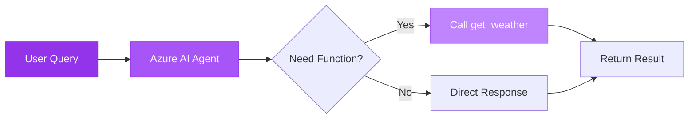
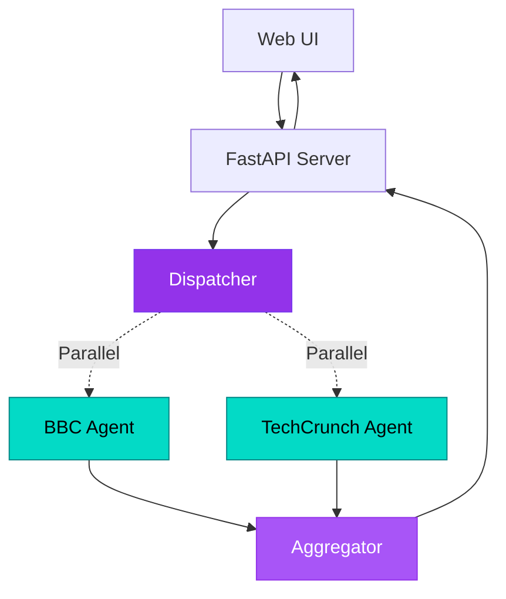
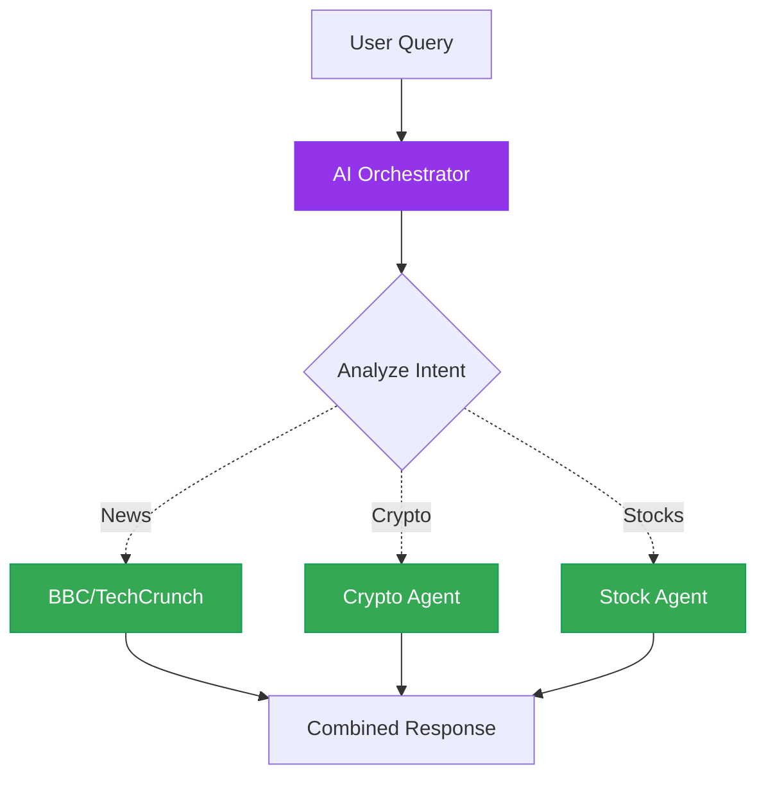
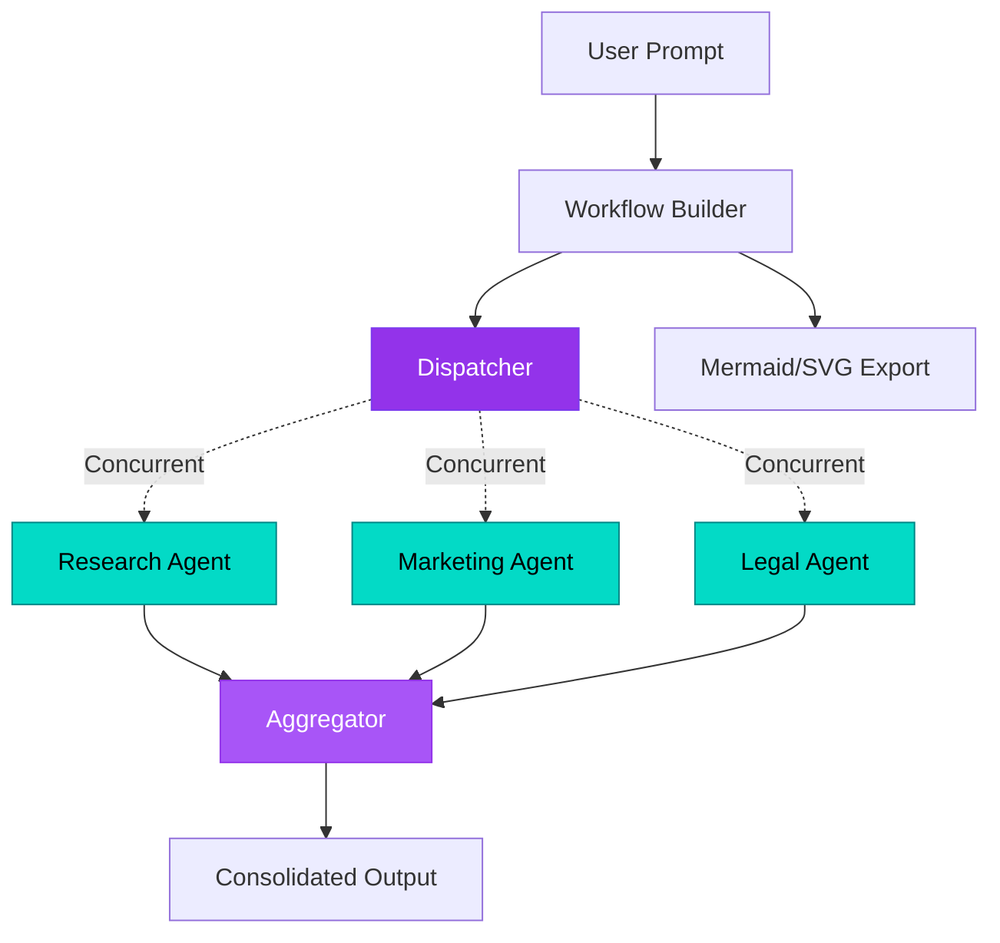

#  Microsoft Agent Framework - Code Samples

Four sample solutions demonstrating AI agent patterns with Microsoft Agent Framework and Azure OpenAI.

---

##  Sample Solutions

### 1. [agentquickstart](./useEntra/agentquickstart) - Basic Agent with Function Calling

Simple agent that uses function tools to respond to user queries.



**What it does:** AI agent calls Python functions based on user intent (e.g., weather queries).

---

### 2. [agentConcurrentOrchestrator](./useEntra/agentConcurrentOrchestrator) - Web Chatbot with Concurrent Fetching

Web UI chatbot that fetches news from multiple sources simultaneously using Fan-Out/Fan-In pattern.



**What it does:** Browser-based chatbot with animated workflow visualization showing concurrent news fetching (50% faster than sequential).

---

### 3. [agentTools](./useEntra/agentTools) - Multi-Agent Orchestrator

AI orchestrator intelligently routes queries to specialized agents (news, crypto, stocks).



**What it does:** AI decides which specialized agents to call based on natural language queries. Can call multiple agents in parallel.

---

### 4. [agentVisualization](./useEntra/agentVisualization) - Advanced Workflow Patterns

Expert agents (Research, Marketing, Legal) process queries in parallel with workflow visualization export.



**What it does:** Advanced workflow with event-driven executors and automatic diagram generation (Mermaid + GraphViz SVG).

---

##  Authentication Methods

### Option 1: useEntra (Entra ID Authentication)

**Path:** `_src/useEntra/`  
**Available in:** All 4 samples

Uses Azure CLI credentials to authenticate with Azure OpenAI (no API keys needed).

#### How to Authenticate

**Step 1: Install Azure CLI**
```bash
# Windows
winget install -e --id Microsoft.AzureCLI

# Or download from: https://aka.ms/installazurecliwindows
```

**Step 2: Login via Terminal**
```bash
az login
```
- Opens browser for authentication
- Sign in with your Azure account
- Credentials cached locally

**Step 3: Verify Login**
```bash
az account show
```

**Step 4: Configure `.env` File**
```env
AZURE_AI_PROJECT_ENDPOINT=https://your-project.openai.azure.com/
AZURE_AI_MODEL_DEPLOYMENT_NAME=gpt-4o
```

**When to use:** Development environments, no credential management needed, automatic authentication.

---

### Option 2: useKey (API Key Authentication)

**Path:** `_src/useKey/`  
**Available in:** All 4 samples

Uses Azure OpenAI API key for direct authentication (no Azure CLI required).

#### How to Get API Key

**Step 1: Open Azure Portal**
- Go to [portal.azure.com](https://portal.azure.com)

**Step 2: Navigate to Azure OpenAI Resource**
- Find your Azure OpenAI resource

**Step 3: Get Keys and Endpoint**
- Click **"Keys and Endpoint"** in left menu
- Copy **KEY 1** or **KEY 2**
- Copy **Endpoint** URL

**Step 4: Configure `.env` File**
```env
AZURE_OPENAI_ENDPOINT=https://your-resource.openai.azure.com/
AZURE_OPENAI_API_KEY=your-api-key-here
AZURE_OPENAI_DEPLOYMENT_NAME=gpt-4o
AZURE_OPENAI_API_VERSION=2024-05-01-preview
```

 **Security:** Never commit `.env` files to version control!

**When to use:** Production deployments, CI/CD pipelines, containerized applications, no Azure CLI dependency.

---

##  Getting Started

### Option A: GitHub Codespaces (Recommended - Zero Setup! 🚀)

GitHub Codespaces provides a **fully configured cloud development environment** with all dependencies pre-installed. No local setup required!

#### What's Pre-configured in Codespaces

✅ **Python 3.11+** - Latest Python runtime  
✅ **All Dependencies** - Packages from requirements.txt auto-installed  
✅ **Azure CLI** - Pre-installed and ready for authentication  
✅ **VS Code Extensions** - Python, Pylance, Azure extensions included  
✅ **Port Forwarding** - Automatic for web apps (e.g., FastAPI on port 8000)  
✅ **Environment Variables** - Secure secrets management via Codespaces Secrets

#### Step-by-Step: Launch Codespaces

**Step 1: Open Repository in Codespaces**

1. Navigate to the [repository on GitHub](https://github.com/khanasif1/demo-microsoft-agent-framework)
2. Click the green **"Code"** button
3. Select the **"Codespaces"** tab
4. Click **"Create codespace on main"**

The environment will build automatically (takes ~2-3 minutes first time).

**Step 2: Configure Azure Credentials**

Once Codespaces opens, you have two authentication options:

**Option 2a: Entra ID Authentication (Recommended for Codespaces)**

```bash
# Login to Azure CLI in the terminal
az login --use-device-code

# Follow the prompts:
# 1. Copy the code displayed
# 2. Open https://microsoft.com/devicelogin in browser
# 3. Paste code and authenticate
# 4. Return to Codespaces terminal

# Verify login
az account show
```

**Option 2b: API Key Authentication**

1. Get your API key from [Azure Portal](https://portal.azure.com) (see "useKey" section above)
2. In Codespaces, go to **Settings** (gear icon) → **Secrets** → **New secret**
3. Create secrets:
   - `AZURE_OPENAI_ENDPOINT` = Your endpoint URL
   - `AZURE_OPENAI_API_KEY` = Your API key
   - `AZURE_OPENAI_DEPLOYMENT_NAME` = Your model deployment name
4. Restart Codespaces to apply secrets

**Step 3: Create `.env` File**

Navigate to your chosen sample and create a `.env` file:

```bash
# For Entra ID authentication
cd _src/useEntra/agentquickstart
cat > .env << 'EOF'
AZURE_AI_PROJECT_ENDPOINT=https://your-project.openai.azure.com/
AZURE_AI_MODEL_DEPLOYMENT_NAME=gpt-4o
EOF

# OR for API Key authentication
cd _src/useKey/agentquickstart
cat > .env << 'EOF'
AZURE_OPENAI_ENDPOINT=https://your-resource.openai.azure.com/
AZURE_OPENAI_API_KEY=your-api-key-here
AZURE_OPENAI_DEPLOYMENT_NAME=gpt-4o
AZURE_OPENAI_API_VERSION=2024-05-01-preview
EOF
```

**Step 4: Run Your First Sample**

```bash
# Virtual environment is already activated in Codespaces!
python azure_ai_basic.py  # for useEntra
# or
python main.py            # for useKey
```

#### 💡 Codespaces Tips

- **Access Web Apps:** For samples like `agentConcurrentOrchestrator`, Codespaces auto-forwards port 8000. Click the notification to open the web UI.
- **Multiple Terminals:** Use the terminal panel to run multiple commands simultaneously.
- **Persist Changes:** Commit and push your changes to save work between Codespaces sessions.
- **Free Tier:** GitHub provides 60 hours/month free for personal accounts (120 core-hours).
- **Stop Codespace:** Click Codespaces icon (bottom-left) → "Stop Current Codespace" when done to save hours.

---

### Option B: Local Development Setup

For developers who prefer working on their local machine.

#### Clone Repository

```bash
git clone https://github.com/khanasif1/demo-microsoft-agent-framework.git
cd demo-microsoft-agent-framework/_src
```

#### Choose Authentication Method

**For Entra ID (Azure CLI):**
```bash
cd useEntra/agentquickstart
```

**For API Key:**
```bash
cd useKey/agentquickstart
```

#### Setup Virtual Environment

**Windows (PowerShell):**
```bash
python -m venv .venv
.\.venv\Scripts\Activate.ps1
pip install -r requirements.txt
```

**macOS/Linux:**
```bash
python3 -m venv .venv
source .venv/bin/activate
pip install -r requirements.txt
```

#### Create `.env` File

Create a `.env` file with your Azure configuration (see authentication sections above).

#### Run the Sample

```bash
python azure_ai_basic.py  # for useEntra
# or
python main.py            # for useKey
```

---

**That's it!** Choose Codespaces for instant setup or local development for offline work. Start building AI agents today!
