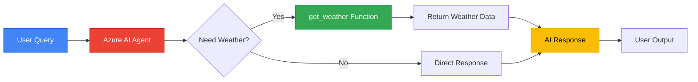
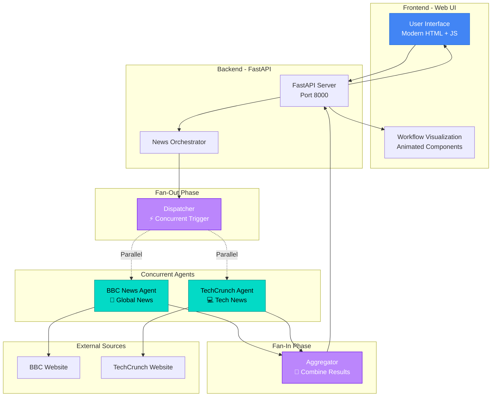
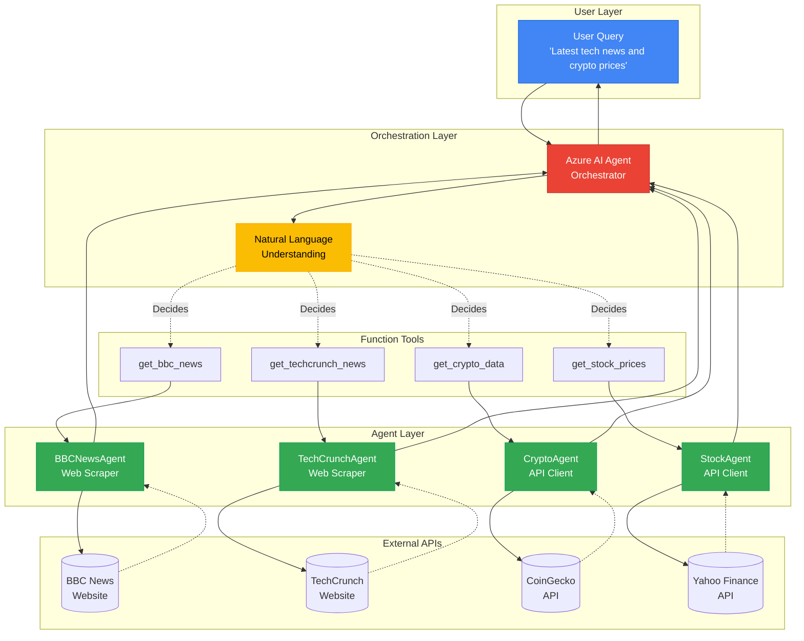
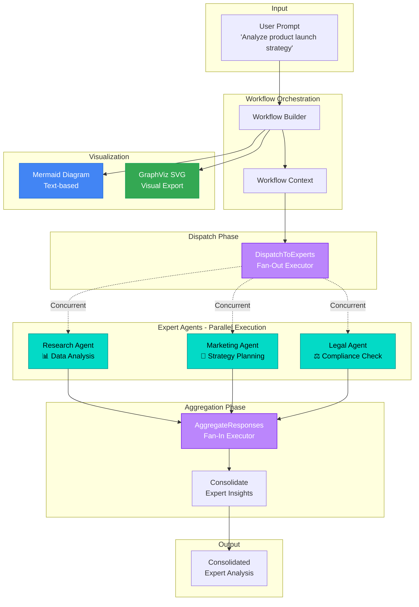

# 🤖 Microsoft Agent Framework - Sample Solutions

This repository contains four comprehensive sample solutions demonstrating different patterns and use cases for building AI agents with the Microsoft Agent Framework and Azure AI services.

---

## 📚 Table of Contents

1. [agentquickstart](#1-agentquickstart---getting-started) - Basic agent creation with function calling
2. [agentConcurrentOrchestrator](#2-agentconcurrentorchestrator---chatbot-with-fanout-fanin) - Web chatbot with concurrent news fetching
3. [agentTools](#3-agenttools---multi-agent-orchestrator) - Multi-agent system with specialized data fetchers
4. [agentVisualization](#4-agentvisualization---workflow-visualization) - Advanced patterns with workflow visualization

---

## 1. agentquickstart - Getting Started

**Path:** [`./agentquickstart`](./agentquickstart)

A beginner-friendly introduction to Microsoft Agent Framework showing basic agent creation, authentication, and function calling capabilities.

### 🏗️ Architecture



### 💡 Key Features

- ✅ **Simple Setup** - Minimal configuration required
- ✅ **Azure CLI Authentication** - No API keys needed
- ✅ **Function Calling** - AI agent calls Python functions
- ✅ **Streaming & Non-Streaming** - Both response modes demonstrated
- ✅ **Environment Variables** - Secure configuration with `.env`

### 🎯 What You'll Learn

- How to create an AI agent with `AzureAIAgentClient`
- Define function tools using type annotations
- Handle both streaming and non-streaming responses
- Authenticate with Azure using Azure CLI credentials
- Configure agents with instructions and tools

### 🚀 Quick Start

```bash
cd agentquickstart
python -m venv .venv
.venv\Scripts\Activate.ps1  # Windows
pip install -r requirements.txt
az login
# Create .env with your Azure AI settings
python azure_ai_basic.py
```

**Example Query:** "What's the weather in Seattle?"

[📖 Full Documentation →](./agentquickstart/README.md)

---

## 2. agentConcurrentOrchestrator - Chatbot with Fan-Out/Fan-In

**Path:** [`./agentConcurrentOrchestrator`](./agentConcurrentOrchestrator)

A modern web-based chatbot with FastAPI backend that demonstrates concurrent execution using the Fan-Out/Fan-In pattern to fetch news from multiple sources simultaneously.

### 🏗️ Architecture



### 💡 Key Features

- ✅ **Web-Based UI** - Modern Material Design 3 dark theme
- ✅ **Real-Time Visualization** - Animated workflow with blinking active components
- ✅ **Concurrent Execution** - 50% faster than sequential processing
- ✅ **RESTful API** - FastAPI backend with Swagger documentation
- ✅ **Multiple News Sources** - BBC News + TechCrunch
- ✅ **Fan-Out/Fan-In Pattern** - Parallel agent execution with result aggregation

### 🎯 What You'll Learn

- Implement concurrent agent execution with `asyncio.gather`
- Build FastAPI endpoints for agent orchestration
- Create interactive web UIs with real-time updates
- Visualize agent workflows with animations
- Handle CORS for web applications
- Aggregate results from multiple agents

### 🚀 Quick Start

```bash
cd agentConcurrentOrchestrator
python api.py
# Open http://localhost:8000 in browser
# Click "Fetch Latest News" button
```

**Response Time:** ~2-3 seconds for both sources (vs 4-6 seconds sequential)

[📖 Full Documentation →](./agentConcurrentOrchestrator/README.md)

---

## 3. agentTools - Multi-Agent Orchestrator

**Path:** [`./agentTools`](./agentTools)

An advanced multi-agent system with specialized agents for different data domains (news, crypto, stocks) orchestrated by Azure AI to intelligently respond to user queries.

### 🏗️ Architecture



### 💡 Key Features

- ✅ **4 Specialized Agents** - BBC News, TechCrunch, Crypto, Stock market
- ✅ **Intelligent Routing** - AI automatically selects appropriate agents
- ✅ **Multi-Domain Queries** - Handle complex queries spanning multiple domains
- ✅ **Extensible Architecture** - Easy to add new agents
- ✅ **Real API Integration** - CoinGecko and Yahoo Finance APIs
- ✅ **Web Scraping** - BeautifulSoup for news websites

### 🎯 What You'll Learn

- Build a multi-agent orchestration system
- Create specialized agents for different data sources
- Implement intelligent agent selection with AI
- Integrate REST APIs and web scraping
- Handle complex user queries with multiple intents
- Design extensible agent architectures

### 🚀 Quick Start

```bash
cd agentTools
python -m venv .venv
.venv\Scripts\Activate.ps1
pip install -r requirements.txt
az login
# Create .env file
python orchestrator.py
```

**Example Query:** "Latest BBC news and Bitcoin price"

[📖 Full Documentation →](./agentTools/README.md)

---

## 4. agentVisualization - Workflow Visualization

**Path:** [`./agentVisualization`](./agentVisualization)

Advanced demonstration of Microsoft Agent Framework's workflow visualization capabilities with Fan-Out/Fan-In pattern using multiple expert agents (Research, Marketing, Legal).

### 🏗️ Architecture



### 💡 Key Features

- ✅ **Workflow Visualization** - Auto-generate Mermaid and GraphViz diagrams
- ✅ **Expert Agents** - Research, Marketing, Legal domain specialists
- ✅ **Event-Driven Architecture** - Handler-based execution model
- ✅ **SVG Export** - Visual workflow diagrams
- ✅ **Dataclass Models** - Type-safe response structures
- ✅ **Workflow Context** - State management across executors

### 🎯 What You'll Learn

- Use `WorkflowBuilder` for complex agent workflows
- Implement custom `Executor` classes
- Create event handlers with `@handler` decorator
- Generate workflow visualizations (Mermaid + GraphViz)
- Manage workflow context and state
- Export workflow diagrams to SVG format

### 🚀 Quick Start

```bash
cd agentVisualization
python -m venv .venv
.venv\Scripts\Activate.ps1
pip install -r requirements.txt
pip install agent-framework[viz] --pre
az login
# Create .env file
python concurrent_with_visualization.py
```

**Output:** Consolidated expert analysis + Mermaid diagram + SVG file

[📖 Full Documentation →](./agentVisualization/README.md)

---

## 🔧 Prerequisites for All Samples

### Required Software

| Tool | Version | Purpose |
|------|---------|---------|
| Python | 3.8+ | Runtime environment |
| Azure CLI | Latest | Authentication |
| pip | Latest | Package management |
| Text Editor | Any | VS Code recommended |

### Azure Setup

1. **Azure Subscription** - Active subscription required
2. **Azure AI Foundry** - Create AI Hub and Project
3. **Model Deployment** - Deploy GPT-4o, GPT-4o-mini, or GPT-3.5-turbo
4. **Authentication** - Run `az login`

### Environment Variables

All samples require `.env` file:

```env
AZURE_AI_PROJECT_ENDPOINT=https://your-project.region.api.azureml.ms/discovery
AZURE_AI_MODEL_DEPLOYMENT_NAME=gpt-4o
```

---

## 📦 Installation

### Clone Repository

```bash
git clone https://github.com/khanasif1/demo-microsoft-agent-framework.git
cd demo-microsoft-agent-framework/_src
```

### Install Dependencies

```bash
# Root requirements (shared by all samples)
pip install -r requirements.txt

# Sample-specific dependencies
cd agentConcurrentOrchestrator && pip install fastapi uvicorn
cd ../agentTools && pip install aiohttp beautifulsoup4 lxml
cd ../agentVisualization && pip install agent-framework[viz] --pre
```

---

## 🚀 Learning Path

### Beginner → Advanced

1. **Start with:** [agentquickstart](#1-agentquickstart---getting-started)
   - Learn basic agent creation
   - Understand function calling
   - Master authentication

2. **Progress to:** [agentConcurrentOrchestrator](#2-agentconcurrentorchestrator---chatbot-with-fanout-fanin)
   - Build web applications
   - Implement concurrent patterns
   - Create interactive UIs

3. **Advance to:** [agentTools](#3-agenttools---multi-agent-orchestrator)
   - Multi-agent systems
   - Intelligent orchestration
   - API integrations

4. **Master with:** [agentVisualization](#4-agentvisualization---workflow-visualization)
   - Advanced workflow patterns
   - Event-driven architecture
   - Visualization techniques

---

## 🎓 Key Concepts Demonstrated

### Design Patterns

| Pattern | Samples | Description |
|---------|---------|-------------|
| **Function Calling** | 1, 2, 3 | AI agents call Python functions |
| **Fan-Out/Fan-In** | 2, 4 | Concurrent execution + aggregation |
| **Multi-Agent** | 3 | Specialized agents for different domains |
| **Event-Driven** | 4 | Handler-based workflow execution |
| **Streaming** | 1 | Real-time response generation |

### Technologies

- **Microsoft Agent Framework** - Core agent capabilities
- **Azure AI Foundry** - Cloud AI infrastructure
- **FastAPI** - Modern web framework (Sample 2)
- **BeautifulSoup** - Web scraping (Samples 2, 3)
- **asyncio** - Async/await patterns (All samples)
- **Pydantic** - Data validation (All samples)

---

## 🐛 Common Issues & Solutions

### Authentication Errors

```bash
# Solution: Re-login to Azure
az logout
az login
az account show
```

### Module Not Found

```bash
# Solution: Ensure virtual environment is active
.venv\Scripts\Activate.ps1  # Windows
source .venv/bin/activate    # macOS/Linux
pip install -r requirements.txt
```

### Environment Variables

```bash
# Solution: Verify .env file exists and has correct format
# No spaces around = sign
# No quotes around values
AZURE_AI_PROJECT_ENDPOINT=https://your-endpoint.com
```

### Port Already in Use (Sample 2)

```bash
# Solution: Kill process on port 8000
netstat -ano | findstr :8000
taskkill /PID <PID> /F
```

---

## 📚 Additional Resources

- [Microsoft Agent Framework Documentation](https://learn.microsoft.com/azure/ai-services/)
- [Azure AI Foundry](https://ai.azure.com)
- [Azure OpenAI Service](https://azure.microsoft.com/products/ai-services/openai-service)
- [FastAPI Documentation](https://fastapi.tiangolo.com/)
- [AsyncIO Guide](https://docs.python.org/3/library/asyncio.html)

---

## 🤝 Contributing

Contributions welcome! Each sample has its own README with specific guidelines.

## 📄 License

MIT License - See [LICENSE](../LICENSE) file

---

## 🎯 Next Steps

1. **Complete the Workshop** - Follow [workshop materials](../workshop/index.html)
2. **Choose Your Sample** - Start with your use case
3. **Build Your Agent** - Customize for your needs
4. **Share Your Work** - Contribute back to the community

---

**Built with ❤️ using Microsoft Agent Framework**

*Last Updated: November 2025*
