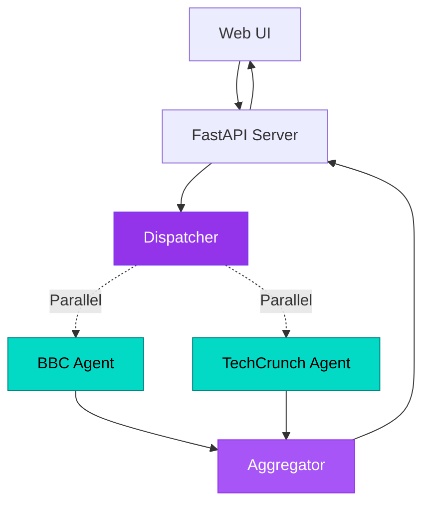

#  Agent Concurrent Orchestrator - Web Chatbot

Browser-based chatbot with animated workflow visualization showing concurrent news fetching.

---

##  Architecture



**Key Components:**
-  **Web UI** - Modern Material Design 3 dark theme
-  **FastAPI Server** - RESTful backend on port 8000
-  **Dispatcher** - Fan-out pattern for concurrent execution
-  **News Agents** - BBC & TechCrunch scrapers
-  **Live Visualization** - Animated workflow with blinking components
-  **Entra ID Auth** - Azure CLI authentication

---

##  Quick Start Options

### Option A: GitHub Codespaces (Recommended)  **Zero Setup!**

GitHub Codespaces provides a fully configured environment with Python, Azure CLI, and all dependencies pre-installed. **Port 8000 auto-forwards** for instant web UI access!

>  **Detailed Codespaces Guide:** See [Main README - GitHub Codespaces](../../README.md#option-a-github-codespaces-recommended---zero-setup-) for complete step-by-step instructions.

**Quick Launch:**
1. Open repository on GitHub → Click **"Code"** → **"Codespaces"** tab → **"Create codespace"**
2. Once launched, authenticate: `az login --use-device-code`
3. Navigate to this solution: `cd _src/useEntra/agentConcurrentOrchestrator`
4. Create `.env` file (see Configuration step below)
5. Run: `python main.py`
6. Click the **port notification** to open the web UI in your browser

---

### Option B: Local Setup

##  Clone & Setup

### 1 Navigate to Solution

```bash
cd demo-microsoft-agent-framework/_src/useEntra/agentConcurrentOrchestrator
```

### 2 Authenticate with Azure CLI

```bash
az login
az account show
```

### 3 Install Dependencies

>  **Full setup instructions:** See [Main README - Local Development Setup](../../README.md#option-b-local-development-setup) for virtual environment and package installation.

Quick setup:
```bash
python -m venv .venv
.\.venv\Scripts\Activate.ps1  # Windows
pip install -r requirements.txt
```

### 4 Configure Environment

Create `.env` file with your Azure AI project endpoint:

```env
AZURE_AI_PROJECT_ENDPOINT=https://your-project.openai.azure.com/
AZURE_AI_MODEL_DEPLOYMENT_NAME=gpt-4o
```

>  **Authentication Details:** [Main README - useEntra Authentication](../../README.md#option-1-useentra-entra-id-authentication)

---

##  Run & Test

### Start the Web Server

```bash
python main.py
```

Server starts at: **http://localhost:8000**

### Expected Output

```
 Server running at http://localhost:8000
 API docs at http://localhost:8000/docs
```

### Test the Application

1. **Open browser** to http://localhost:8000
2. **Click** "Fetch Latest News" button
3. **Watch** animated workflow visualization
4. **View** concurrent news results (BBC + TechCrunch)

### Performance

-  **Concurrent:** ~2-3 seconds
-  **Sequential:** ~4-6 seconds
-  **Speed Boost:** 50% faster!

---

##  What You'll Learn

-  Build web-based AI applications
-  Implement Fan-Out/Fan-In patterns
-  Create live workflow visualizations
-  Concurrent agent execution with asyncio
-  RESTful APIs with FastAPI
-  Web scraping with BeautifulSoup

---

** Next Step:** Try [agentTools](../agentTools) for multi-agent orchestration!
