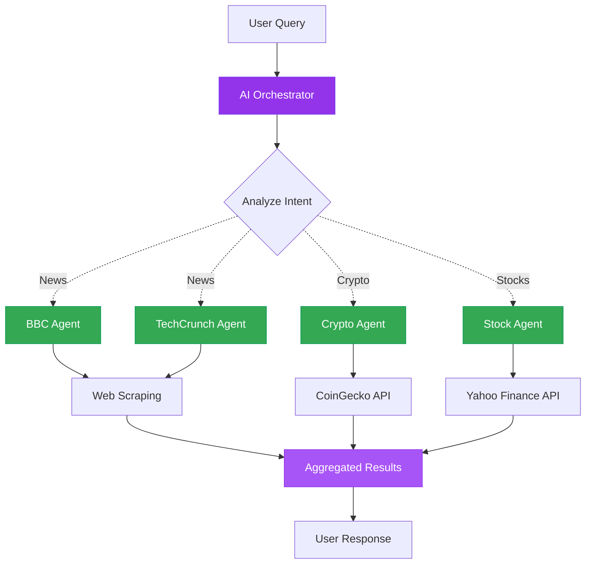

#  Agent Tools - Multi-Agent Orchestrator

AI orchestrator that intelligently routes queries to specialized agents using Entra ID authentication.

---

##  Architecture



**Key Components:**
-  **AI Orchestrator** - Intelligently routes to specialized agents
-  **News Agents** - BBC & TechCrunch web scrapers
-  **Crypto Agent** - Real-time cryptocurrency data
-  **Stock Agent** - Stock market prices
-  **Entra ID Auth** - Azure CLI authentication (no keys needed)

---

##  Quick Start Options

### Option A: GitHub Codespaces (Recommended)  **Zero Setup!**

GitHub Codespaces provides a fully configured environment with Python, Azure CLI, and all dependencies pre-installed.

>  **Detailed Codespaces Guide:** See [Main README - GitHub Codespaces](../../README.md#option-a-github-codespaces-recommended---zero-setup-) for complete step-by-step instructions.

**Quick Launch:**
1. Open repository on GitHub → Click **"Code"** → **"Codespaces"** tab → **"Create codespace"**
2. Once launched, authenticate: `az login --use-device-code`
3. Navigate to this solution: `cd _src/useEntra/agentTools`
4. Install additional dependencies: `pip install aiohttp beautifulsoup4 lxml requests`
5. Create `.env` file (see Configuration step below)
6. Run: `python orchestrator.py`

---

### Option B: Local Setup

##  Clone & Setup

### 1 Navigate to Solution

```bash
cd demo-microsoft-agent-framework/_src/useEntra/agentTools
```

### 2 Authenticate with Azure CLI

```bash
az login
az account show
```

### 3 Install Dependencies

>  **Full setup instructions:** See [Main README - Local Development Setup](../../README.md#option-b-local-development-setup) for virtual environment and package installation.

Quick setup:
```bash
python -m venv .venv
.\.venv\Scripts\Activate.ps1  # Windows
pip install -r ../../requirements.txt
pip install aiohttp beautifulsoup4 lxml requests
```

### 4 Configure Environment

Create `.env` file with your Azure AI project endpoint:

```env
AZURE_AI_PROJECT_ENDPOINT=https://your-project.openai.azure.com/
AZURE_AI_MODEL_DEPLOYMENT_NAME=gpt-4o
```

>  **Authentication Details:** [Main README - useEntra Authentication](../../README.md#option-1-useentra-entra-id-authentication)

---

##  Run & Test

### Run the Orchestrator

```bash
python orchestrator.py
```

### Expected Output

```
 AI Orchestrator Active!

Query: "Latest tech news and Bitcoin price"

 Fetching from TechCrunch...
 Fetching crypto data...

Results:
[Tech articles and Bitcoin price displayed]
```

### Test Queries

Try these multi-domain prompts:
-  "Latest tech news"
-  "Bitcoin price"
-  "BBC news headlines"
-  "Latest tech news and crypto prices"
-  "Stock prices for MSFT"

---

##  What You'll Learn

-  Build multi-agent orchestration systems
-  AI-powered intelligent routing
-  Integrate multiple APIs (CoinGecko, Yahoo Finance)
-  Web scraping with BeautifulSoup
-  Extensible agent architecture
-  Azure CLI authentication

---

** Next Step:** Try [agentVisualization](../agentVisulaization) for advanced workflow patterns!
