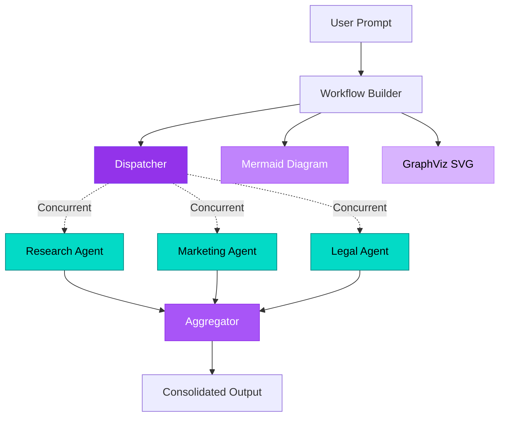

#  Agent Visualization - Advanced Workflow Patterns

Expert agents process queries in parallel with automatic workflow visualization export (Mermaid + SVG).

---

##  Architecture



**Key Components:**
-  **Workflow Builder** - Define complex agent workflows
-  **Dispatcher** - Fan-out pattern for concurrent execution
-  **Expert Agents** - Research, Marketing, Legal specialists
-  **Visualization Export** - Auto-generate Mermaid + SVG diagrams
-  **Event-Driven** - Handler-based execution model
-  **Entra ID Auth** - Azure CLI authentication

---

##  Quick Start Options

### Option A: GitHub Codespaces (Recommended)  **Zero Setup!**

GitHub Codespaces provides a fully configured environment with Python, Azure CLI, and all dependencies pre-installed.

>  **Detailed Codespaces Guide:** See [Main README - GitHub Codespaces](../../README.md#option-a-github-codespaces-recommended---zero-setup-) for complete step-by-step instructions.

**Quick Launch:**
1. Open repository on GitHub → Click **"Code"** → **"Codespaces"** tab → **"Create codespace"**
2. Once launched, authenticate: `az login --use-device-code`
3. Navigate to this solution: `cd _src/useEntra/agentVisulaization`
4. Install visualization dependencies: `pip install agent-framework[viz] --pre`
5. Create `.env` file (see Configuration step below)
6. Run: `python concurrent_with_visualization.py`
7. View generated diagrams: `workflow_diagram.mmd` and `workflow_diagram.svg`

---

### Option B: Local Setup

##  Clone & Setup

### 1 Navigate to Solution

```bash
cd demo-microsoft-agent-framework/_src/useEntra/agentVisulaization
```

### 2 Authenticate with Azure CLI

```bash
az login
az account show
```

### 3 Install Dependencies

>  **Full setup instructions:** See [Main README - Local Development Setup](../../README.md#option-b-local-development-setup) for virtual environment and package installation.

Quick setup:
```bash
python -m venv .venv
.\.venv\Scripts\Activate.ps1  # Windows
pip install -r ../../requirements.txt
pip install agent-framework[viz] --pre
```

### 4 Configure Environment

Create `.env` file with your Azure AI project endpoint:

```env
AZURE_AI_PROJECT_ENDPOINT=https://your-project.openai.azure.com/
AZURE_AI_MODEL_DEPLOYMENT_NAME=gpt-4o
```

>  **Authentication Details:** [Main README - useEntra Authentication](../../README.md#option-1-useentra-entra-id-authentication)

---

##  Run & Test

### Run the Workflow

```bash
python concurrent_with_visualization.py
```

### Expected Output

```
 Building Workflow...
 Executing concurrent agents...

 Research Agent: [Analysis results]
 Marketing Agent: [Strategy insights]
 Legal Agent: [Compliance review]

 Workflow complete!
 Generated: workflow_diagram.mmd
 Generated: workflow_diagram.svg
```

### Generated Files

After execution, you'll find:
-  `workflow_diagram.mmd` - Mermaid diagram source
-  `workflow_diagram.svg` - Visual workflow diagram

### Test Prompts

Try these business scenarios:
-  "Analyze our product launch strategy"
-  "Review compliance for new feature"
-  "Create go-to-market plan"

---

##  What You'll Learn

-  Build event-driven agent workflows
-  Implement parallel agent execution
-  Generate workflow visualizations automatically
-  Create specialized expert agents
-  Use WorkflowBuilder for complex orchestration
-  Export diagrams (Mermaid + GraphViz SVG)

---

** Next Step:** Explore [useKey](../../useKey) for API Key authentication!
