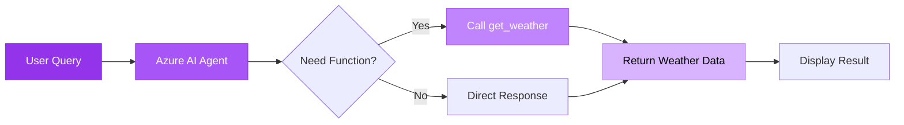

#  Agent Quickstart - Basic Function Calling

Simple AI agent that calls Python functions based on user intent using Entra ID authentication.

---

##  Architecture



**Key Components:**
-  **Azure AI Agent** - Powered by GPT-4o with function calling
-  **Function Tool** - `get_weather()` function for weather queries
-  **Entra ID Auth** - Azure CLI authentication (no keys needed)

---

##  Clone & Setup

### 1 Navigate to Solution

```bash
cd demo-microsoft-agent-framework/_src/useEntra/agentquickstart
```

### 2 Authenticate with Azure CLI

```bash
az login
az account show
```

### 3 Install Dependencies

>  **Full setup instructions:** See [Main README - Getting Started](../../README.md#-getting-started) for virtual environment and package installation.

Quick setup:
```bash
python -m venv .venv
.\.venv\Scripts\Activate.ps1  # Windows
pip install -r ../../requirements.txt
```

### 4 Configure Environment

Create `.env` file with your Azure AI project endpoint:

```env
AZURE_AI_PROJECT_ENDPOINT=https://your-project.openai.azure.com/
AZURE_AI_MODEL_DEPLOYMENT_NAME=gpt-4o
```

>  **Authentication Details:** [Main README - useEntra Authentication](../../README.md#option-1-useentra-entra-id-authentication)

---

##  Run & Test

### Run the Sample

```bash
python azure_ai_basic.py
```

### Expected Output

```
 AI Agent Response:
The weather in Seattle is 72F and sunny.
```

### Test Queries

Try these prompts:
-  "What's the weather in Seattle?"
-  "Tell me the weather in Tokyo"
-  "How's the weather in London?"

---

##  What You'll Learn

-  Create AI agents with function calling
-  Authenticate with Azure CLI (Entra ID)
-  Define custom function tools
-  Handle user queries intelligently

---

** Next Step:** Try [agentConcurrentOrchestrator](../agentConcurrentOrchestrator) for web-based concurrent agents!
