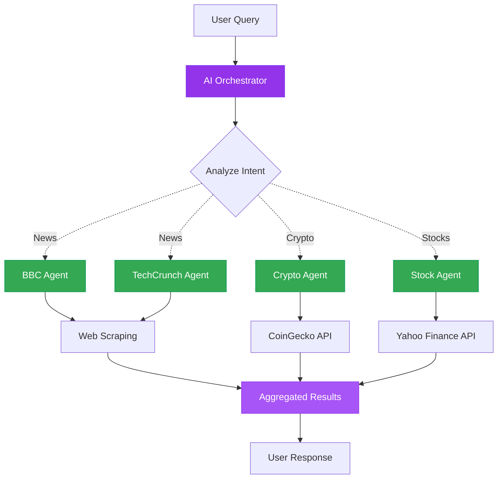

#  Agent Tools - Multi-Agent Orchestrator

AI orchestrator that intelligently routes queries to specialized agents using API Key authentication.

---

##  Architecture



**Key Components:**
-  **AI Orchestrator** - Routes queries to specialized agents
-  **News Agents** - BBC & TechCrunch web scrapers
-  **Crypto Agent** - Real-time cryptocurrency data
-  **Stock Agent** - Stock market prices
-  **API Key Auth** - Azure OpenAI authentication

---

##  Clone & Setup

### 1 Navigate to Solution

```bash
cd demo-microsoft-agent-framework/_src/useKey/agentTools
```

### 2 Install Dependencies

>  **Full setup instructions:** See [Main README - Getting Started](../../README.md#-getting-started) for virtual environment and package installation.

Quick setup:
```bash
python -m venv .venv
.\.venv\Scripts\Activate.ps1  # Windows
pip install -r ../../requirements.txt
pip install aiohttp beautifulsoup4 lxml requests
```

### 3 Configure Environment

Create `.env` file with your Azure OpenAI credentials:

```env
AZURE_OPENAI_ENDPOINT=https://your-resource.openai.azure.com/
AZURE_OPENAI_API_KEY=your-api-key-here
AZURE_OPENAI_DEPLOYMENT_NAME=gpt-4o
AZURE_OPENAI_API_VERSION=2024-05-01-preview
```

>  **Get API Key:** [Main README - useKey Authentication](../../README.md#option-2-usekey-api-key-authentication)

---

##  Run & Test

### Run the Orchestrator

```bash
python orchestrator.py
```

### Expected Output

```
 AI Orchestrator Active!

Query: "Latest tech news and Bitcoin price"

 Fetching from TechCrunch...
 Fetching crypto data...

Results:
[Tech articles and Bitcoin price displayed]
```

### Test Queries

Try these multi-domain prompts:
-  "Latest tech news"
-  "Bitcoin price"
-  "BBC news headlines"
-  "Latest tech news and crypto prices"
-  "Stock prices for MSFT"

---

##  What You'll Learn

-  Build multi-agent orchestration systems
-  AI-powered intelligent routing
-  Integrate multiple APIs (CoinGecko, Yahoo Finance)
-  Web scraping with BeautifulSoup
-  Extensible agent architecture

---

** Next Step:** Explore [useEntra](../../useEntra) for Azure CLI authentication!
