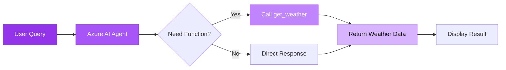

#  Agent Quickstart - Basic Function Calling

Simple AI agent that calls Python functions based on user intent using API Key authentication.

---

##  Architecture



**Key Components:**
-  **Azure AI Agent** - Powered by GPT-4o with function calling
-  **Function Tool** - `get_weather()` function for weather queries
-  **API Key Auth** - Direct Azure OpenAI authentication

---

##  Quick Start Options

### Option A: GitHub Codespaces (Recommended)  **Zero Setup!**

GitHub Codespaces provides a fully configured environment with Python, Azure CLI, and all dependencies pre-installed.

>  **Detailed Codespaces Guide:** See [Main README - GitHub Codespaces](../../README.md#option-a-github-codespaces-recommended---zero-setup-) for complete step-by-step instructions.

**Quick Launch:**
1. Open repository on GitHub → Click **"Code"** → **"Codespaces"** tab → **"Create codespace"**
2. Once launched, navigate to this solution: `cd _src/useKey/agentquickstart`
3. Create `.env` file (see Configuration step below)
4. Run: `python azure_ai_basic.py`

---

### Option B: Local Setup

##  Clone & Setup

### 1 Navigate to Solution

```bash
cd demo-microsoft-agent-framework/_src/useKey/agentquickstart
```

### 2 Install Dependencies

>  **Full setup instructions:** See [Main README - Local Development Setup](../../README.md#option-b-local-development-setup) for virtual environment and package installation.

Quick setup:
```bash
python -m venv .venv
.\.venv\Scripts\Activate.ps1  # Windows
pip install -r ../../requirements.txt
```

### 3 Configure Environment

Create `.env` file with your Azure OpenAI credentials:

```env
AZURE_OPENAI_ENDPOINT=https://your-resource.openai.azure.com/
AZURE_OPENAI_API_KEY=your-api-key-here
AZURE_OPENAI_DEPLOYMENT_NAME=gpt-4o
AZURE_OPENAI_API_VERSION=2024-05-01-preview
```

>  **Get API Key:** [Main README - useKey Authentication](../../README.md#option-2-usekey-api-key-authentication)

---

##  Run & Test

### Run the Sample

```bash
python azure_ai_basic.py
```

### Expected Output

```
 AI Agent Response:
The weather in Seattle is 72F and sunny.
```

### Test Queries

Try these prompts:
-  "What's the weather in Seattle?"
-  "Tell me the weather in Tokyo"
-  "How's the weather in London?"

---

##  What You'll Learn

-  Create AI agents with function calling
-  Authenticate with API keys
-  Define custom function tools
-  Handle user queries intelligently

---

** Next Step:** Try [agentTools](../agentTools) for multi-agent orchestration!
