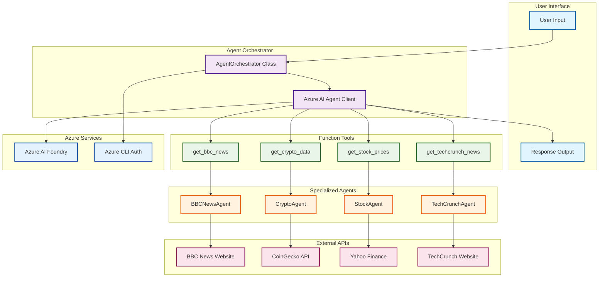

# 🤖 Agent Tools - Multi-Agent Orchestrator

A sophisticated AI-powered orchestrator that integrates multiple specialized agents (BBC News, TechCrunch, Crypto, Stock) with Azure AI Agent Framework to provide intelligent data fetching and AI-powered responses.

## 1. 🏗️ Mermaid Architecture



### Architecture Components

- **User Interface**: Command-line interface for user interaction
- **Agent Orchestrator**: Main coordination layer using Azure AI Agent Framework
- **Function Tools**: AI-callable functions that bridge between the orchestrator and agents
- **Specialized Agents**: Independent data fetchers for specific domains
- **External APIs**: Third-party services for data retrieval
- **Azure Services**: Authentication and AI processing services

## 2. �️ How to Setup the Code with venv

### Prerequisites
- Python 3.8 or higher
- Azure CLI installed
- Azure subscription with AI Foundry access

### Step-by-Step Setup

#### 1. Clone and Navigate
```bash
git clone <repository-url>
cd demo-microsoft-agent-framework/agentTools
```

#### 2. Create Virtual Environment
```bash
# Create virtual environment
python -m venv .venv

# Activate virtual environment
# Windows (PowerShell)
.venv\Scripts\Activate.ps1

# Windows (Command Prompt)
.venv\Scripts\activate.bat

# macOS/Linux
source .venv/bin/activate
```

#### 3. Install Dependencies
```bash
# Upgrade pip
python -m pip install --upgrade pip

# Install required packages
pip install -r ../requirements.txt

# Install additional packages for this project
pip install aiohttp beautifulsoup4 lxml pydantic python-dotenv
```

#### 4. Azure Authentication Setup
```bash
# Login to Azure CLI
az login

# Verify login
az account show

# Set subscription (if multiple)
az account set --subscription "your-subscription-id"
```

#### 5. Environment Configuration
```bash
# Copy example environment file
cp .env.example .env
```

Edit the `.env` file with your Azure AI configuration:
```env
# Azure AI Project Configuration
AZURE_AI_PROJECT_ENDPOINT=https://your-project.eastus.api.azureml.ms
AZURE_AI_MODEL_DEPLOYMENT_NAME=gpt-4o-deployment

# Optional: Additional Configuration
AZURE_SUBSCRIPTION_ID=your-subscription-id
AZURE_RESOURCE_GROUP=your-resource-group
```

#### 6. Verify Installation
```bash
# Test import
python -c "from agent_framework.azure import AzureAIAgentClient; print('✅ Agent Framework Ready')"

# Test Azure connection
az account show --output table
```

## 3. ▶️ How to Run the Code

### Basic Usage
```bash
# Ensure virtual environment is activated
.venv\Scripts\Activate.ps1  # Windows
# source .venv/bin/activate  # macOS/Linux

# Run the orchestrator
python orchestrator.py
```

### Example Interactions

#### 1. News Queries
```bash
Enter your query: What's the latest BBC news?
```

#### 2. Crypto Queries
```bash
Enter your query: Bitcoin price
Enter your query: Top 5 cryptocurrencies
```

#### 3. Combined Queries
```bash
Enter your query: Latest tech news and crypto prices
Enter your query: BBC news about technology and Bitcoin updates
```

### Sample Output
```
Enter your query (news topic or crypto symbol): What's happening in tech and crypto?

=== News Summary ===
Based on the latest information:

📰 **BBC Tech News:**
1. AI Breakthrough in Healthcare Technology
   Link: https://www.bbc.com/news/technology-12345

2. New Quantum Computing Milestone Reached
   Link: https://www.bbc.com/news/science-67890

💎 **Cryptocurrency Update:**
• Bitcoin (BTC): $45,230.50 (+2.34%)
• Ethereum (ETH): $2,890.12 (-1.23%)
• Binance Coin (BNB): $310.45 (+0.89%)

The technology sector shows significant advancement in AI applications...
```

### Advanced Usage

#### Environment Variable Override
```bash
# Override endpoint for testing
AZURE_AI_PROJECT_ENDPOINT="https://test-endpoint.azure.com" python orchestrator.py
```

#### Debug Mode
```bash
# Enable verbose logging
export PYTHONPATH=$PYTHONPATH:.
python -c "
import asyncio
from orchestrator import AgentOrchestrator
async def debug():
    orch = AgentOrchestrator()
    result = await orch.get_bbc_news('technology')
    print(f'Debug result: {result}')
asyncio.run(debug())
"
```

## 4. ❓ FAQ, Bugs & Fixes

### Frequently Asked Questions

#### Q1: What agents are currently available?
**A:** The orchestrator includes four specialized agents:
- **BBCNewsAgent**: Fetches news from BBC News website
- **CryptoAgent**: Gets cryptocurrency prices from CoinGecko API
- **StockAgent**: Retrieves stock data from Yahoo Finance
- **TechCrunchAgent**: Fetches tech news from TechCrunch

#### Q2: How does the AI decide which agents to call?
**A:** The Azure AI Agent Framework analyzes user queries using natural language understanding and automatically selects appropriate function tools based on context keywords and intent.

#### Q3: Can I add custom agents?
**A:** Yes! Follow this pattern:
1. Create a new agent class inheriting from `BaseAgent`
2. Implement the `execute()` method
3. Add a function tool in the orchestrator
4. Include it in the agent's tools list

### Common Bugs & Fixes

#### 🐛 Bug #1: Import Error - `agent_framework.azure`
```
ModuleNotFoundError: No module named 'agent_framework'
```
**🔧 Fix:**
```bash
pip install azure-ai-agent-framework
# or
pip install agent-framework-azure-ai
```

#### 🐛 Bug #2: Authentication Error (401 Unauthorized)
```
Error code: 401 - {'statusCode': 401, 'message': 'Unauthorized. Access token is missing, invalid...'}
```
**🔧 Fix:**
```bash
# Re-login to Azure
az logout
az login

# Verify subscription
az account show

# Check endpoint format in .env
# Should be: https://your-project.eastus.api.azureml.ms
# Not: https://your-project.eastus.api.azureml.ms/api/projects/project-name
```

#### 🐛 Bug #3: Environment Variables Not Found
```
Error: AZURE_AI_PROJECT_ENDPOINT not found in environment variables
```
**🔧 Fix:**
```bash
# Check if .env file exists
ls -la .env

# Verify content
cat .env

# Ensure no extra spaces or quotes
# Correct: AZURE_AI_PROJECT_ENDPOINT=https://example.com
# Wrong: AZURE_AI_PROJECT_ENDPOINT = "https://example.com"
```

#### � Bug #4: Connection Timeout/Network Issues
```
aiohttp.client_exceptions.ClientConnectorError: Cannot connect to host
```
**🔧 Fix:**
```bash
# Check internet connection
ping google.com

# Verify firewall/proxy settings
# For corporate networks, configure proxy:
export HTTP_PROXY=http://proxy.company.com:8080
export HTTPS_PROXY=http://proxy.company.com:8080

# Test individual agents
python -c "
import asyncio
from tools.bbc_news_agent import BBCNewsAgent
async def test():
    agent = BBCNewsAgent()
    result = await agent.execute('test')
    print(result)
asyncio.run(test())
"
```

#### 🐛 Bug #5: Azure AI Model Deployment Not Found
```
Error: The model deployment 'gpt-4.1' was not found
```
**🔧 Fix:**
```bash
# Check available deployments
az cognitiveservices account deployment list --name YOUR_RESOURCE_NAME --resource-group YOUR_RG

# Update .env with correct deployment name
AZURE_AI_MODEL_DEPLOYMENT_NAME=gpt-35-turbo
# or
AZURE_AI_MODEL_DEPLOYMENT_NAME=gpt-4
```

#### 🐛 Bug #6: Agent Returns Empty Results
```
BBC News error: No articles found
```
**🔧 Fix:**
```bash
# Check if websites have changed structure
# Update CSS selectors in agent files:

# For BBC News Agent - update selectors in bbc_news_agent.py
headlines = soup.find_all('h2', {'data-testid': 'card-headline'}, limit=5)

# Test manually
curl -s "https://www.bbc.com/news" | grep -i "headline"
```

### Performance Optimization

#### Memory Usage
```bash
# Monitor memory usage
python -c "
import psutil
import asyncio
from orchestrator import main
print(f'Memory before: {psutil.Process().memory_info().rss / 1024 / 1024:.2f} MB')
asyncio.run(main())
"
```

#### Response Time
```bash
# Add timing to orchestrator.py
import time

async def get_agent_responses(self, topic: str = None) -> str:
    start_time = time.time()
    # ... existing code ...
    end_time = time.time()
    print(f"⏱️ Response generated in {end_time - start_time:.2f} seconds")
```

### Development Tips

#### Testing Individual Components
```bash
# Test BBC Agent only
python -c "
import asyncio
from tools.bbc_news_agent import BBCNewsAgent
async def test_bbc():
    agent = BBCNewsAgent()
    result = await agent.execute('technology')
    print('BBC Result:', result['status'], len(result.get('data', [])))
asyncio.run(test_bbc())
"

# Test Crypto Agent only
python -c "
import asyncio  
from tools.crypto_agent import CryptoAgent
async def test_crypto():
    agent = CryptoAgent()
    result = await agent.execute('bitcoin')
    print('Crypto Result:', result['status'], len(result.get('data', [])))
asyncio.run(test_crypto())
"
```

#### Logging Configuration
```python
# Add to orchestrator.py for debugging
import logging
logging.basicConfig(level=logging.DEBUG)
logger = logging.getLogger(__name__)
```

---

## 📞 Support

- **Issues**: Open an issue on the GitHub repository
- **Documentation**: Check the [Microsoft Agent Framework docs](https://learn.microsoft.com/en-us/agent-framework/)
- **Azure Support**: Visit [Azure AI Foundry documentation](https://docs.microsoft.com/azure/ai-studio/)